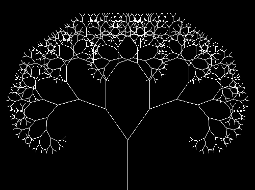
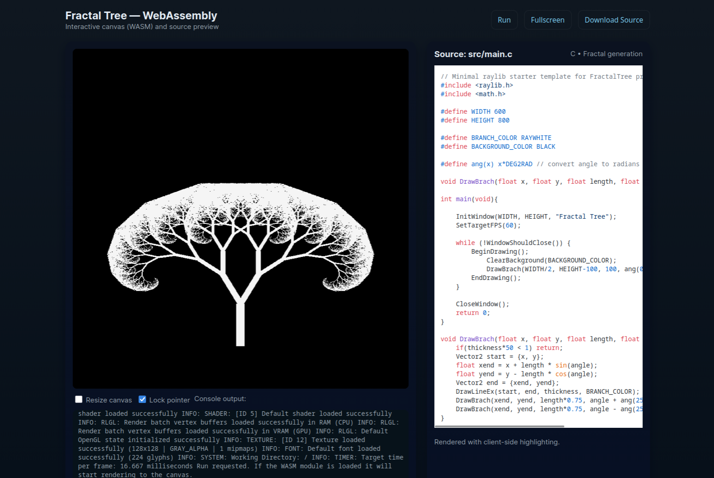

FractalTree



A small drawing and fractal-playground written in C and ported to raylib.

Purpose: personal exploration and small demos of fractal shapes and drawing tools.

Build & Run (native):

```sh
make
./bin/fractal_tree
```

WebAssembly (WASM) support:

This project includes a minimal WebAssembly build that can run the fractal
renderer in the browser. To try it locally, serve the `web/` folder over HTTP
and open `web/index.html`. The page embeds the C source and renders console
output in-page when the WASM is available.

Example WASM screenshot:



These ASCII lines are a small, static demonstration of a recursive / self-similar
pattern (inspired by Sierpinski-like branching). Replace this with live rendering
in `src/main.c` to produce interactive fractal visuals.

Notes:
- This repo uses raylib and a pkg-config driven Makefile for the native build.
- Ensure `raylib` and `pkg-config` are installed on your system before building.